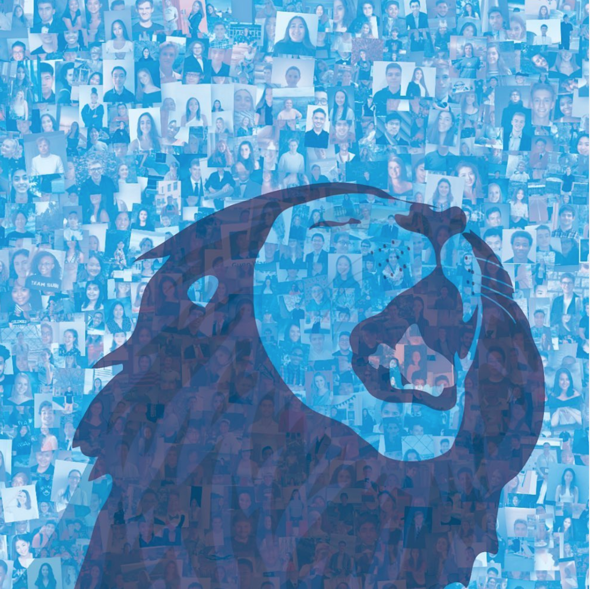

<br/>

## Welcome to Minjie's website


I am a MS Biostatistics student at Columbia University. Thank you for visiting my website!<br/>

## Coding and Statistics:

I love data science and statistics, especially in building website, data visualization and modeling! More information can be found in my [RESUME](resume.html).
<br/>


Here's one example of Type I error simulation of 100 samples:
```{r message=FALSE}
set.seed(99)
n.sample2 <- 100
#Sample indices
sample.indices <- list()
n = 0
se = 15/sqrt(20)
for (i in 1:n.sample2) {
  sample2 <- rnorm(20, mean = 120, sd = 15)
sample2_mean = mean(sample2)
z_stats <- (sample2_mean-120)/se
z_crit <- qnorm(0.05)
if(z_stats >= z_crit) {
  #print("0")
} else {
  #print("1 Type I Error")
  n = n + 1
}
}
percentage = n/100
print(percentage)
```
<br/>



## Key Links:

Viewing my LinkedIn, Github, or Instagram:

Appreciate your connection!!!

* [LinkedIn] (https://www.linkedin.com/in/anna0609)
* [Github] (https://www.linkedin.com/in/anna0609)
* [Instagram] (https://www.instagram.com/annabao0609/)

 

## Hobbies:
Love traveling all over the world and playing the piano! I am interested in classical music and ballet. If I am not going to be a technical person, I might be a pianist and perform my own concert around the world.

Here’s me hiking on the Bear Mountain in NY:


<br/>

## Fun Facts:

I want to raise a Maltese puppy in the future. 


<br/>

## My Resume by CSS:

[RESUME](resume.html)

Currently looking for a full-time job actively! Targeted in Data Scientist / Front-End Developer / Statistical Programmer / Biostatistician / Consultant positions.

<br/>

## Personality and Skills: {.tabset}

### Personality

detail-oriented

communicative

curiosity

proactive

gritty

### Skills

SAS

R

Python

Java

SQL

Matlab

Microsoft (Excel, PowerPoint, Word)

ANOVA

Tableau


### Languages

English (fluent)

Mandarin (fluent)

French (proficient)

Japanese (basic)

### Certificates

SAS Certified Specialist: Base Programming Using SAS 9.4

SAS Certified Professional: Advanced Programming Using SAS 9.4

Youth Mentoring Theory and Practice
